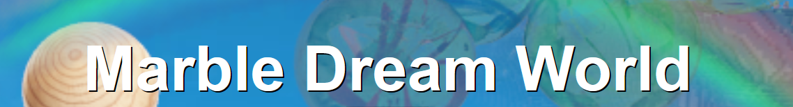
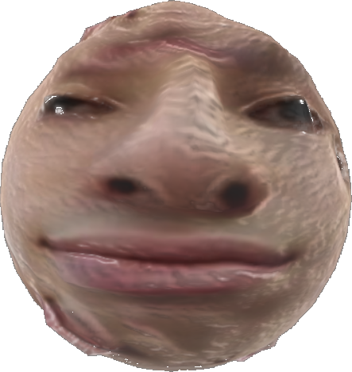
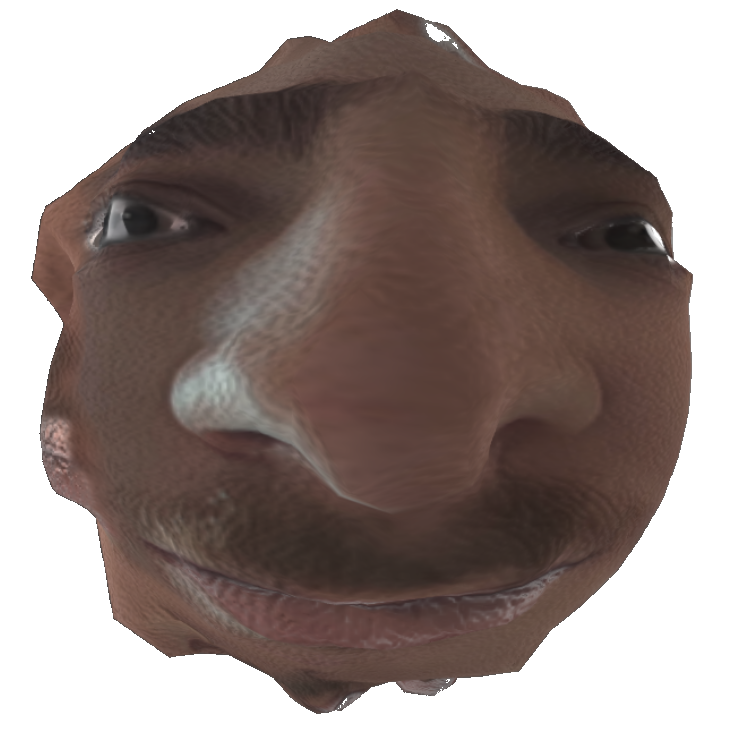
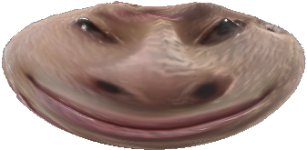

# Welcome to Marble Dreamland ! 

Welcome to the Marble Dream World, a captivating realm where dreams and nightmares coexist with marbles, inhabited by the unique Marble-Guys, beings who are a blend of human and marble.

In this mystical world, you will journey through ever-changing dreamscapes filled with beauty and magic, as well as treacherous nightmarescapes that challenge your courage. The Marble-Guys, guardians of this land, live in harmony with their environment, drawing strength from dreams and facing the trials of nightmares. 

However, the sinister Theo le Galot threatens to plunge Marble Dream World into eternal darkness by corrupting dreams and amplifying nightmares. Your mission is to traverse this enchanting world, rally the Marble-Guys, harness the power of dreams, and confront the dark forces of Theo le Galot to restore balance and preserve the magic of Bille Monde.

> Hello, I am Bill the Bille, I seak your help to save thou people tha ma kingdown.

> Hark, I am Théo le Galot, beware thee if thou dost dare to challenge me!
# Let's go 

> Come with me we'll live a great adventure!

Here
https://gamesonweb.github.io/dreamland-Jempasam/dist/index.html